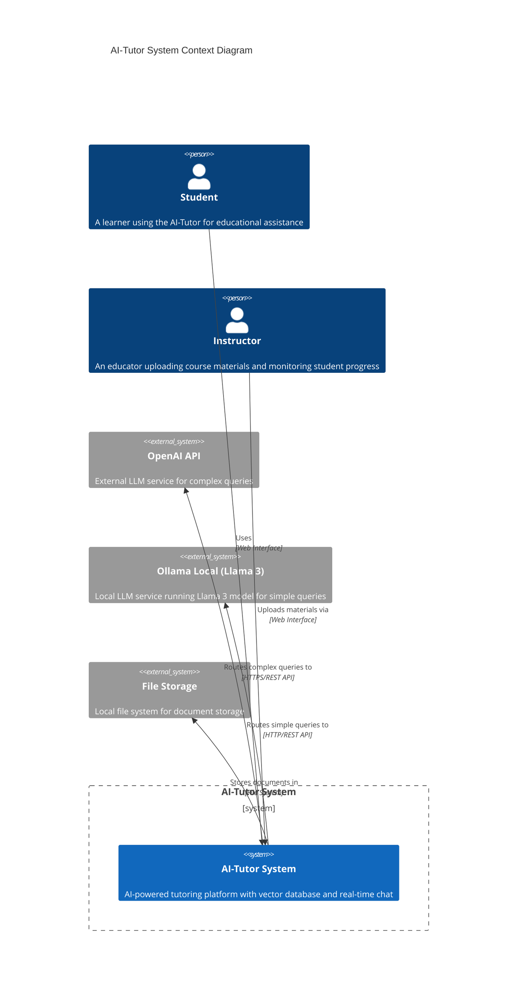
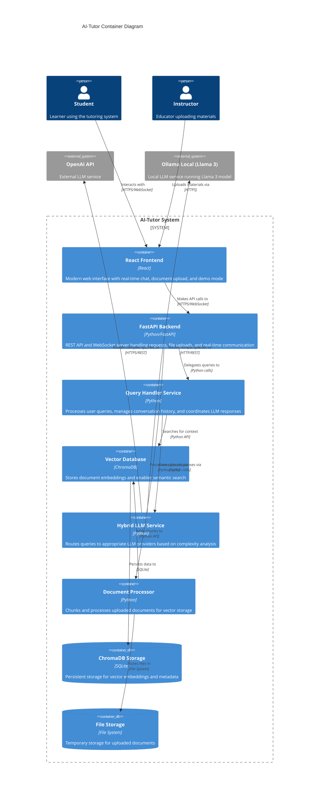
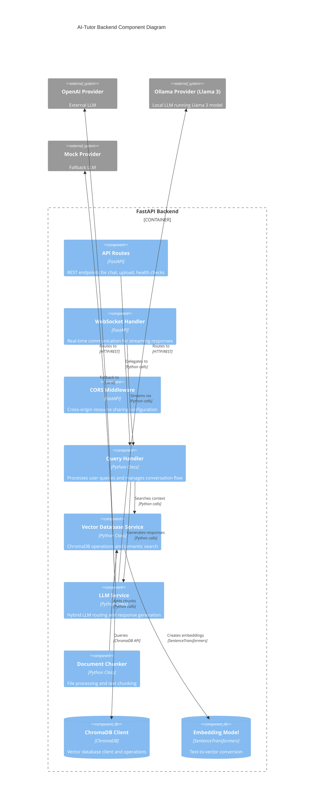
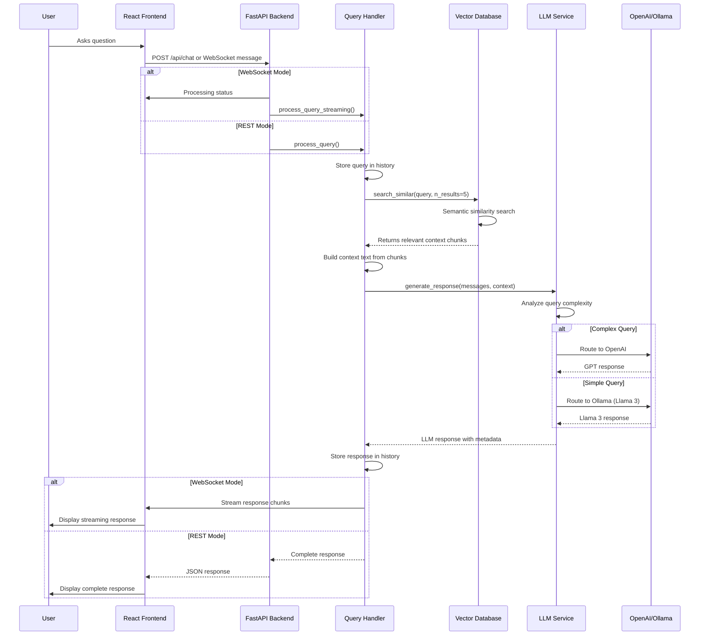
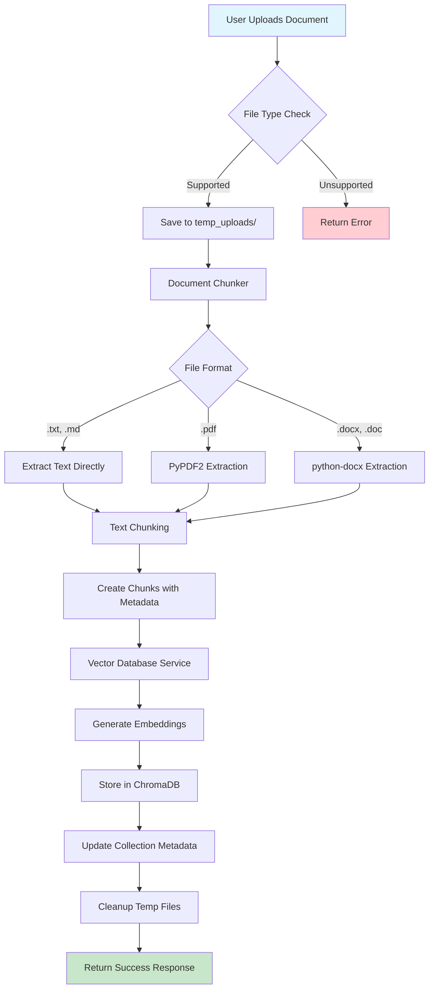
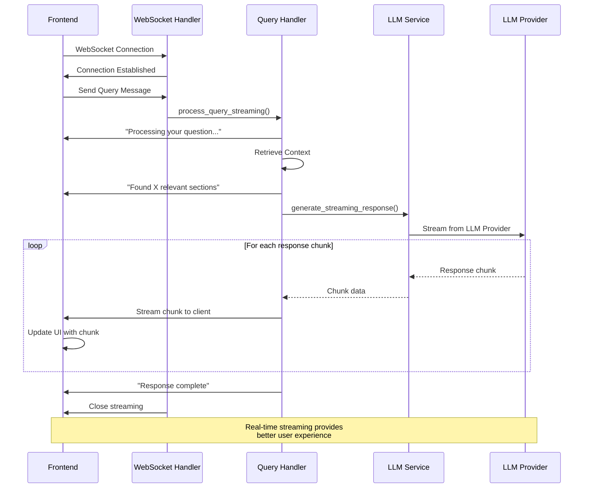

# AI-Tutor System Architecture Diagrams

This document contains comprehensive Mermaid diagrams illustrating the architecture of the AI-Tutor system, a hybrid LLM-powered educational platform with vector database integration.

**Quick reference (single-page):** [AI-Tutor Architecture draw.io](ai_tutor_architecture.drawio) — open in [diagrams.net](https://app.diagrams.net) or VS Code Draw.io extension. [HTML view](ai_tutor_architecture.html) for browser/print.

## Table of Contents
1. [System Context Diagram](#1-system-context-diagram)
2. [Container Diagram](#2-container-diagram)
3. [Component Diagram](#3-component-diagram)
4. [Query Processing Sequence Diagram](#4-query-processing-sequence-diagram)
5. [Document Upload Flow](#5-document-upload-flow)
6. [WebSocket Communication Flow](#6-websocket-communication-flow)
7. [LLM Provider Routing](#7-llm-provider-routing)

---

## 1. System Context Diagram

This diagram shows the AI-Tutor system in its environment, including users and external systems.



---

## 2. Container Diagram

This diagram shows the high-level shape of the AI-Tutor system and how responsibilities are distributed across containers.



---

## 3. Component Diagram

This diagram shows how the backend services are organized internally.



---

## 4. Query Processing Sequence Diagram

This diagram shows the flow of a user query through the system.



---

## 5. Document Upload Flow

This diagram shows how documents are processed and stored in the vector database.



---

## 6. WebSocket Communication Flow

This diagram shows the real-time communication between frontend and backend.



---

## 7. LLM Provider Routing

This diagram shows how the hybrid LLM service routes queries to appropriate providers.

```mermaid
flowchart TD
    A[User Query] --> B[Query Complexity Analyzer]
    
    B --> C{Complexity Analysis}
    
    C -->|Simple| D[Simple Keywords Detected]
    C -->|Complex| E[Complex Keywords Detected]
    C -->|Unknown| F[Default Routing]
    
    D --> G[Route to Ollama (Llama 3)]
    E --> H[Route to OpenAI]
    F --> I[Try Ollama (Llama 3) First]
    
    G --> J{Llama 3 Available?}
    H --> K{OpenAI Available?}
    I --> L{Llama 3 Available?}
    
    J -->|Yes| M[Generate Response with Llama 3]
    J -->|No| N[Fallback to Mock]
    
    K -->|Yes| O[Generate Response with GPT]
    K -->|No| P[Fallback to Llama 3]
    
    L -->|Yes| M
    L -->|No| Q{OpenAI Available?}
    
    P --> R{Llama 3 Available?}
    Q -->|Yes| O
    Q -->|No| N
    
    R -->|Yes| M
    R -->|No| N
    
    M --> S[Return Response]
    O --> S
    N --> S
    
    S --> T[Add Routing Metadata]
    T --> U[Return to Query Handler]
    
    style A fill:#e3f2fd
    style S fill:#c8e6c9
    style N fill:#fff3e0
```

---

## Architecture Key Features

### 1. **Hybrid LLM Architecture**
- **Intelligent Routing**: Queries are analyzed for complexity and routed to appropriate LLM providers
- **Llama 3 Integration**: Local Llama 3 model via Ollama for simple queries and fallback scenarios
- **Fallback Strategy**: Multiple fallback options ensure system reliability (Llama 3 → Mock)
- **Provider Abstraction**: Unified interface for different LLM services

### 2. **Vector Database Integration**
- **Semantic Search**: ChromaDB enables context-aware responses
- **Document Chunking**: Intelligent text splitting with overlap
- **Persistent Storage**: SQLite-based persistence for embeddings

### 3. **Real-time Communication**
- **WebSocket Support**: Streaming responses for better UX
- **Dual Mode**: Both REST API and WebSocket endpoints
- **Connection Management**: Robust WebSocket connection handling

### 4. **Document Processing Pipeline**
- **Multi-format Support**: PDF, DOCX, TXT, MD files
- **Intelligent Chunking**: Sentence-boundary aware splitting
- **Metadata Preservation**: Rich metadata for each document chunk

### 5. **Frontend Architecture**
- **React-based UI**: Modern, responsive interface
- **Demo Mode**: Offline demonstration capability
- **Real-time Updates**: Live streaming of AI responses
- **Markdown Rendering**: Rich text display with syntax highlighting

---

## Technology Stack

### Backend
- **FastAPI**: Modern Python web framework
- **ChromaDB**: Vector database for embeddings
- **SentenceTransformers**: Text embedding generation
- **OpenAI API**: External LLM service (GPT-3.5-turbo)
- **Ollama**: Local LLM service running **Llama 3** model
- **WebSocket**: Real-time communication

### Frontend
- **React**: Component-based UI framework
- **ReactMarkdown**: Markdown rendering
- **WebSocket API**: Real-time communication
- **CSS3**: Modern styling and animations

### Infrastructure
- **SQLite**: ChromaDB persistence
- **File System**: Document storage
- **CORS**: Cross-origin resource sharing
- **Environment Variables**: Configuration management

---

## Llama 3 Configuration Details

### Ollama Setup with Llama 3
The AI-Tutor system is configured to use **Llama 3** as the primary local LLM provider through Ollama:

```bash
# Install Llama 3 via Ollama
ollama pull llama3

# Verify installation
ollama list
```

### Configuration Parameters
- **Model**: `llama3` (default Ollama model)
- **Base URL**: `http://localhost:11434` (default Ollama server)
- **Temperature**: 0.7 (configurable per query)
- **Max Tokens**: 1000 (configurable per query)

### Query Routing Strategy
- **Simple Queries**: Routed to Llama 3 for fast, local processing
- **Complex Queries**: Routed to OpenAI GPT-3.5-turbo for advanced reasoning
- **Fallback**: Llama 3 serves as primary fallback when OpenAI is unavailable
- **Mock Provider**: Final fallback for testing and development

### Performance Benefits
- **Low Latency**: Local processing eliminates network round-trips
- **Cost Effective**: No API costs for simple queries
- **Privacy**: Sensitive queries processed locally
- **Reliability**: Works offline when OpenAI API is unavailable

---

## Deployment Considerations

### Development Environment
- Local ChromaDB instance
- Ollama local LLM server
- File-based document storage
- Hot-reload enabled FastAPI server

### Production Considerations
- **Scalability**: ChromaDB clustering for large document collections
- **Security**: API key management and CORS configuration
- **Monitoring**: Health checks and logging
- **Backup**: Database backup and restore capabilities

---

*This architecture documentation provides a comprehensive overview of the AI-Tutor system's design, components, and data flows. The diagrams illustrate both the high-level system context and detailed internal component interactions.*
